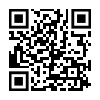

# SBX Talk

=> great talk by Michael Irwin from Docker about sbx: https://www.youtube.com/watch?v=fBpe6fEt-v8  
=> docs: https://docs.docker.com/ai/sandboxes/

## Link to repo

## Customize

### Templates

=> docs: https://docs.docker.com/ai/sandboxes/customize/templates

- `docker build -t <docker-username>/sbx-talk:v1 .`
- `sbx run --template <docker-username>/sbx-talk:v1 claude`

### Kits

=> docs: https://docs.docker.com/ai/sandboxes/customize/kits  
=> cookbook: https://github.com/dvdksn/kits-cookbook

- `sbx run claude --kit ./my-kit`
